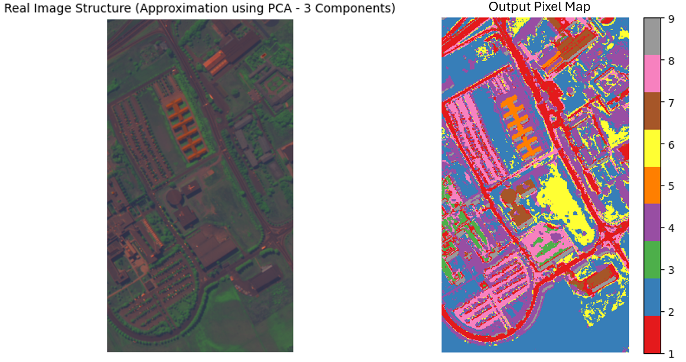
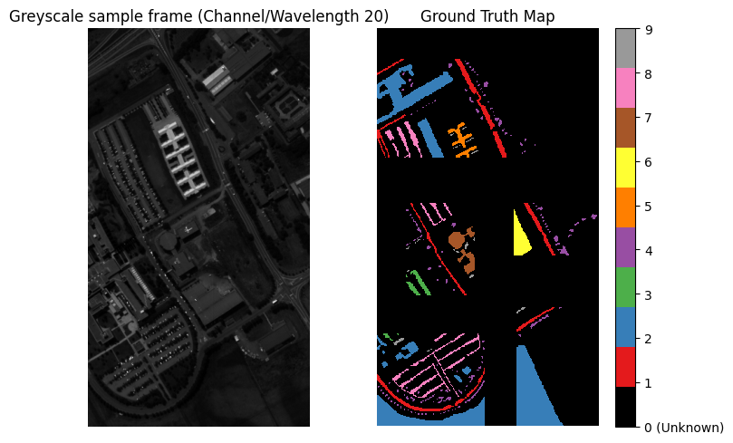
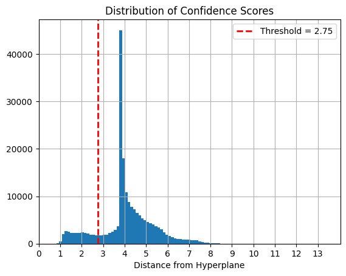
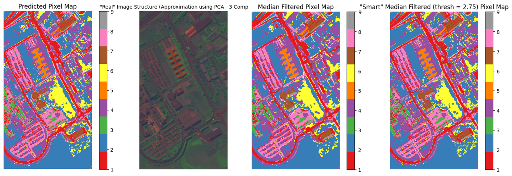

# Pattern Recognition Final Project


 [](https://colab.research.google.com/github/iliaxant/Pattern_Recognition_Final_Project/blob/main/Final_Project_PR_58545.ipynb)


> A set of Machine Learning models developed for Pattern Recognition tasks, featuring industrial process fault detection (binary classification) and hyperspectral image (multiclass) classification.


# Table of Contents

* [Project Overview](#project-overview)
* [Project Structure](#project-structure)
* [Dependencies](#dependencies)
  * [Codes and Resources Used](#codes-and-resources-used)
  * [Python Packages Used](#python-packages-used)
* [Data](#data)
  * [Task 1](#task-1-1)
  * [Task 2](#task-2-1)
* [Setup Instructions](#setup-instructions)
* [Task 1](#task-1-2)
  * [Code Structure](#code-structure)
  * [Results and Evaluation](#results-and-evaluation)
* [Task 2](#task-2-2)
  * [Code Structure](#code-structure-1)
  * [Results and Evaluation](#results-and-evaluation-1)
* [Proposed Improvements](#proposed-improvements)
* [References](#references)


# Project Overview

These implementations are submissions for the final project of the class of "Pattern Recognition" (DUTH ECE: 9th Semester 2025-2026), for which students were tasked to develop two machine learning models. 


### Task 1

A system that detects faults in an industrial process that produces semiconductors. The input is a collection of sensor measurements in different stages of the production procedure and the model output is a prediction of whether the samples present the desired normal operation or a faulty operation (binary classification).

```
    Probability
0       0.189140
1       0.202409
2       0.076705
3       0.133381
4       0.075945
..           ...
308     0.024652
309     0.026147
310     0.086703
311     0.046149
312     0.046005
```
*Fig. 1: The model output predictions that correspond to the probability of the test set samples being faulty.*

The submitted implementation involves the appropriate data preprocessing, including missing data handling, to train a Random Forest classifier, the optimal parameters of which are achieved through hyperparameter searching and the proper validation.  


### Task 2

A system that solves the problem of image segmentation in a hyperspectral image. The goal is the creation of a map of land-cover (multiclass classification) of the research area using only the classifications of the model. The input data are the high-dimensionality spectral vectors for each pixel of the image. The vectors correspond to different wavelengths of the electromagnetic spectrum.


*Fig. 2: The approximated image of the research area (left) and the output/predicted pixel map (right).*

The developed solution performs data preprocessing, featuring average filtering for utilizing the data morphology, trains and validates a Support Vector Machine with RBF kernel after a proper hyperparameter optimization, and postprocesses the final pixel map by applying a median filter on pixels of weak predictions.

#

The test set outputs of both models were evaluated by the class professor and all student submissions were ranked based on performance. The present implementation of the second task has achieved the **3rd highest F1-score** of the 2025-2026 class, while the first model has achieved a high place in the ranking but not a podium spot.


# Project Structure

The repository is structured as below:
```bash
├── data
│   └── Final_Project_data.zip
├── media
├── predictions
│   ├── test_predictions_task1_58545.csv
│   └── test_predictions_task2_58545.csv
├── 58545_.pdf
├── Final_Project_PR_58545.ipynb
└── README.md
```
* `data`: Directory containing the `Final_Project_data.zip` which contains the data files: `Training_data_manifacturing.csv` and `Test_data_manifacturing.csv` for the first problem and `HyperspectralTask.mat` for the second.
* `media`: Directory containing pictures used in the `README.md` file.
* `predictions`: Directory containing the two submissions required for the evaluation and ranking of the implementations.
* `58545_.pdf`: A short presentation *(in greek)* highlighting the methodology followed and the achieved validation performance of both systems.
* `Final_Project_PR_58545.ipynb`: The heart of the project. A Jupyter notebook containing the step-by-step implementation of both machine learning models *(text cells in greek)*. 


# Dependencies

## Codes and Resources Used
* **Editor Used:** Google Colab / Jupyter Notebook
* **Python Version:** 3.12 (Google Colab Default Runtime at the time of the project)

## Python Packages Used
All the necessary dependencies needed for the reproduction of the project are categorized as follows:

> **Note:** Since this project is developed entirely within Google Colab, the package versions listed below correspond to the default Colab environment at the time of the last code update (February 2026).

* **General Purpose & Utilities:**
  * `zipfile` *(Built-in with Python 3.12)*: For extracting dataset archives.
  * `random` *(Built-in with Python 3.12)*: For generating random numbers and setting random states for reproducibility.
  * `h5py` *(v3.11.x)*: For reading and interacting with the HDF5 formatted data.

* **Data Manipulation & Analysis:**
  * `numpy` *(v2.1.x)*: For numerical operations, matrix handling and array manipulation.
  * `pandas` *(v2.2.x)*: For data structuring and handling tabular data.

* **Machine Learning & Pattern Recognition:**
  * `scikit-learn` *(v1.5.x)*: The core library used for the machine learning pipeline. Specifically utilized for:
    * **Preprocessing:** `StandardScaler`, `SimpleImputer`
    * **Dimensionality Reduction:** `PCA`
    * **Model Selection & Tuning:** `train_test_split`, `StratifiedKFold`, `GridSearchCV`, `RandomizedSearchCV`, `Pipeline`
    * **Classifiers:** `RandomForestClassifier`, `SVC`
    * **Metrics:** `accuracy_score`, `confusion_matrix`, `classification_report`, `roc_auc_score`, `f1_score`, etc.

* **Scientific Computing & Signal Processing:**
  * `scipy` *(v1.14.x)*: Utilized for defining statistical distributions for hyperparameter tuning and applying spatial filters to data.

* **Data Visualization:**
  * `matplotlib` *(v3.9.x)*: Used for foundational plotting and custom color mapping.
  * `seaborn` *(v0.13.x)*: For generating custom color palettes.


# Data

## Task 1

The data provided for this task are the training set file `Training_data_manifacturing.csv` and the test set file `Test_data_manifacturing.csv`. 

> **Note:** There is a strong possibility that the provided data are a modified part of a larger publicly available dataset, but its exact origin was not disclosed. Consequently, there is no direct attribution or link provided here. The inclusion of this data is strictly for educational purposes and code reproducibility.


* **Data Description:** 

  The `Training_data_manifacturing.csv` training set consists of 1254 samples with each of them having 474 features. The samples are organized in lines, the features in columns and in the final column the class labels of each sample are stored, where '0' signals normal and '1' faulty operation. There is huge class imbalance (0->93.3%, 1->6.7%) and 5.53% of all values are missing.
  
  The `Test_data_manifacturing.csv` test set is made of 313 samples with the same ratio of missing values, but there is no class column, meaning that the true labels are hidden.


## Task 2

The data provided for this task is the `HyperspectralTask.mat`, which is a hyperspectral image of **Pavia University** provided by Prof. Paolo Gamba[^1]. The file used is a modified version of the original as the image is cropped and the ground truth partial.

* **Original Source Link:** [Pavia University Scene](https://www.ehu.eus/ccwintco/index.php/Hyperspectral_Remote_Sensing_Scenes#Pavia_Centre_and_University)
* **Modified Data Description:** The `HyperspectralTask.mat` is a hyperspectral image formatted as *MATLAB v7.3 (HDF5)*. The file contains a 3-dimensional data cube of 610px height, 340px width and 103 spectral bands, but also the ground truth of 610px height and 340px width. The classes correspond to the labels '1' through '9', but not all pixels are labeled, with the majority of them belonging to the "unlabeled" class '0'. The classes of the labeled pixels are heavily imbalanced with the most common class reaching 53.66% and least common 1.27%.
* **Data Preprocessing:** The `Final_Project_PR_58545.ipynb` notebook already takes care of it, but it must be mentioned that the data stored in `HyperspectralTask.mat` need to be transposed so they are arranged as ***(height x width x spectral bands)*** and not as the original ***(spectral bands x width x height)***.



*Fig. 3: a) Greyscale image of a random channel of the hyperspectral image, b) Ground truth of the pixel map.*


# Setup Instructions

1. **Load the Notebook:** Upload and open the `Final_Project_PR_58545.ipynb` file in Google Colab.
2. **Load the Data:** Go to the `data` directory, download the `Final_Project_data.zip` file. No need to extract the files inside, just upload the `.zip` directly into Colab's temporary session storage using the ***Files*** section on the left sidebar and run the first code cell of `Final_Project_PR_58545.ipynb`.
3. **Force-install Specific Package Versions:** Since cloud environments update their software frequently, newer versions of libraries might cause compatibility issues. If you encounter any unexpected errors while running the cells, please force-install the specific package versions listed in the [Python Packages Used](#codes-and-resources-used) section. To do that create a new code cell and run, for example, the command `!pip install scikit-learn==1.5.0`.
4. **Complete Setup:** Run the two last code cells of the *Setup* section of `Final_Project_PR_58545.ipynb` to import the utilized libraries and define the function that sets the random seeds for reproducibility.


# Task 1

## Code Structure

### Part A: Data Analysis

In this sector the contents of `Training_data_manifacturing.csv` and `Test_data_manifacturing.csv` files are analyzed in order to print useful information for the user about the data. Useful information involves percentages of each class in the training set and the ratio of missing values for each feature.


### Part B: Data Preprocessing

The applied methods of data processing involve:

1. **Removal of (quasi-) constant features:** Features with mostly constant values (specifically with >=99% consistency) are removed in order to reduce redundancy.

    ```
    Constant / Quasi-Constant (>= 99.0% same value) Feature list:
    ['Feat 68', 'Feat 188', 'Feat 191', 'Feat 287', 'Feat 292', 'Feat 388']

    Removing 6 Constant / Quasi-Constant Features...
    ```
    *Fig. 4: Result/output of (quasi-) constant feature removal.*


2. **Removal of features with excessive missing values:** Features with missing value ratio of 80% and over are removed as a method of dimensionality reduction, provided the data are not **Missing Not At Random (MNAR)**. In this project features with data MNAR are identified when the difference in the amount of missing value between the two classes is greater or equal to 10%.

    ```
    Missing >=80.0% of values Feature list:
    ['Feat 79', 'Feat 148', 'Feat 149', 'Feat 202', 'Feat 247', 'Feat 248', 'Feat 303', 'Feat 401']

    ---------- MNAR Check ----------

    Feat 79 : Missing Rate Class 0(-) = 85.56% | Class 1(+) = 90.48% | Diff =   4.92%
    Feat 148: Missing Rate Class 0(-) = 91.79% | Class 1(+) = 94.05% | Diff =   2.25%
    Feat 149: Missing Rate Class 0(-) = 91.79% | Class 1(+) = 94.05% | Diff =   2.25%
    Feat 202: Missing Rate Class 0(-) = 85.56% | Class 1(+) = 90.48% | Diff =   4.92%
    Feat 247: Missing Rate Class 0(-) = 91.79% | Class 1(+) = 94.05% | Diff =   2.25%
    Feat 248: Missing Rate Class 0(-) = 91.79% | Class 1(+) = 94.05% | Diff =   2.25%
    Feat 303: Missing Rate Class 0(-) = 85.56% | Class 1(+) = 90.48% | Diff =   4.92%
    Feat 401: Missing Rate Class 0(-) = 85.56% | Class 1(+) = 90.48% | Diff =   4.92%

    Summary: Possible MNAR (Diff >= 10.0%) -> 
    []

    --------------------------------

    Removing 8 features:
    ['Feat 79', 'Feat 148', 'Feat 149', 'Feat 202', 'Feat 247', 'Feat 248', 'Feat 303', 'Feat 401']
    ```

    *Fig. 5: Result/output of process of removing features with excessive missing values.*

3. **Missing Value Handling**: Τhe NaN cells of the remaining features are filled using  *SimpleImputer()* of sklearn, meaning that within a feature the blank spaces are replaced with the same value. In this implementation, the way the replacement value is calculated is a hyperparameter.


### Part C: Data Splitting

The training data is split into 5 folds so K-Fold Crossover Validation is possible. The splitting occurs after shuffling the samples and it is stratified sο the ratio between the two classes within each fold is maintained.


### Part D: Choosing a classifier

Although there is no code for this part, the classifier choice has to be mentioned. The task is solved using a Random Forest classifier with bootstrapping enabled. The rest of its parameters are hyperparameters that are optimized.


### Part E: Hyperparameter Optimization

In this section the model is trained multiple times to find the optimal hyperparameters. The optimization occurs in two parts:

1. **Hyperparameter searching**: The hyperparameter space is searched to locate the optimal set. The search is conducted using Random Search with Crossover Validation using the splits of *Part C* . Deciding metric for the suitability of the hyperparameter set is the **Area Under ROC curve**. The search pipeline consists of filling the missing data cells as per *Part B.3* and then training and validating, both individually for each fold. The Random Search has been executed multiple times for different parameter distributions, with each search running for 100 iterations. The searched parameters (with the distributions of most recent execution) are:

    ```python
    'imputer__strategy': ['median', 'most_frequent'],
    'clf__n_estimators': randint(200, 1200),
    'clf__max_depth': randint(10, 25),
    'clf__min_samples_leaf': randint(2, 15),
    'clf__min_samples_split': randint(2, 20),
    'clf__max_features': uniform(0.01, 0.97),
    'clf__class_weight': ['balanced', 'balanced_subsample']
    ```

2. **Fine tuning**: After a satisfying number of searches, the same, as with the search, pipeline is used to further train and validate the classifier, but only for a specific set of hyperparameters at a time in order to fine tune the model, while utilizing the information obtained during the searching. In this part, more detailed information about the training and validation are printed, including ROC AUC and PR AUC, and an optimal threshold for the predictions is chosen by maximizing the F1-score. The deciding factor for choosing the best set of hyperparameters is whether it maximizes the **ROC AUC**.


### Part F: Model Retraining and Testing

After settling on the optimal hyperparameters, the classifier is then retrained on all the training data (meaning there is no validation) and then tested on the test set to produce the predictions necessary for the submitted `test_predictions_task1_58545.csv` file, as per instructed. 


## Results and Evaluation

The optimal classifier discovered during the optimization of *Part E* is the one with the below set of hyperparameters:

```python
imp_strategy = 'most_frequent'
rf_n_classifiers = 800
rf_max_depth = 22
rf_min_samples_leaf = 5
rf_min_samples_split = 15
rf_max_features = 0.3009
rf_class_weight = 'balanced'
```
Training and validating the model using the above parameters leads to the following results and metrics:

```
=============== Training Summary ===============

Average ROC AUC (Random Classifier = 0.5000): 0.7786  (std = 0.0470)
Average PR AUC (Baseline = 0.0670): 0.2537  (std = 0.0815)
Average Optimal Threshold: 0.1760  (std = 0.0171)

--- After Optimal Threshold ---
Average Precision: 25.87%  (std = 4.96%)
Average Recall:    54.93%  (std = 9.72%)
Average F1 Score:  34.45%  (std = 0.04%)

================================================
```

Part of the predictions produced during the final retraining and testing of *Part F* can be seen in *Fig. 1*.

The deciding factor for the ranking of the students' implementations was the **Area Under ROC curve**. Although the present submission has not achieved a podium position, the model tested **higher than 0.8 ROC AUC**, exceeding the estimated ROC AUC of 0.7786. 


# Task 2

## Code Structure

### Part A: Data Analysis

In this sector the contents of `HyperspectralTask.mat` are converted into an appropriate format and then are analyzed in order to print useful information  for the user about the data. Useful information involves percentages of each class in the training set, sample image of a random channel and a plot of the per class mean spectral signature (*Fig. 3*).


### Part B: Data Preprocessing

The applied methods of data processing involve:

1. **Data augmentation through spatial averaging:** To each pixel of each channel (feature) of the original image, a 5x5 averaging (low pass) filter with mirroring for dealing with the pixels of border is applied. The new channel images act as extra features, thus doubling the dimensions of the problem, but including the morphology / spatial correlation of the samples. 

    ```
    Spatial averaging with a (5x5) filter...

    Original Data shape: (610, 340, 103)
    Augmented Data shape (Spectral Info + Spatial Mean): (610, 340, 206)

    Original Num of features: 103
    Num of features after augmentation: 206
    ```
    *Fig. 6: Output messages of feature augmentation through spatial averaging.*


2. **Normalization:** Z-score normalization is applied to the augmented dataset. The mean and std are calculated using the whole dataset and not just the training data, as this problem belongs to the category of transductive machine learning.


### Part C: Data Splitting

The training data is split into 5 folds so K-Fold Crossover Validation is possible. The splitting occurs after shuffling the samples and it is stratified sο the ratio between the classes within each fold is maintained.


### Part D: Choosing a classifier

Although there is no code for this part, the classifier choice has to be mentioned. The task is solved using a SVM with RBF kernel as, according to relevant papers[^2] [^3], it is an acceptable and efficient solution to the problem of multiclass classification in hyperspectral images. The `C` and `gamma` parameters of the classifier are the hyperparameters of the model that are optimized.


### Part E: Hyperparameter Optimization

In this section the model is trained multiple times in order to find the optimal hyperparameters. The optimization occurs in two parts:

1. **Hyperparameter searching**: The hyperparameter space is searched to find the optimal set. The search is conducted using Grid Search with Crossover Validation while using **Macro F1-score** as the defining metric. The Grid Search algorithm has been executed multiple times for different grids, since the chosen classifier has a very small training time and the hyperparameters are only two in number. Below the hyperparameters of the searching, as well as the last grid searched are shown:

    ```python
    'clf__C': [500, 600, 800, 1000, 2000, 4000, 5000],
    'clf__gamma': [0.005, 0.006, 0.008, 0.01, 0.02, 0.04, 0.05]
    ```

2. **Fine tuning**: After a satisfying number of searches, the classifier is further trained and validated, but only for a specific set of hyperparameters at a time in order to fine tune the model, while utilizing the information obtained during the searching. In this part, more detailed information about the training and validation are printed, including the accuracy, macro F1 and weighted F1 score. The deciding factor in choosing the best set of hyperparameters is whether it maximizes the **macro F1 score**.


### Part F: Model Retraining and Testing

After settling on the optimal hyperparameters, the classifier is retrained on all the training data (meaning there is no validation) and then tested on the whole dataset to produce a pixel map of predictions.

### Part G: Post-processing

In this section two post-processes are tested in order to find the one that (hopefully) increases the accuracy of the predictions:

1. **Median filtering**: A 3x3 median filter with mirroring for the border pixels is applied to all pixels of the model's prediction map, as a way to smooth out the estimations. 

2. **"Smart" median filtering**: In order to avoid oversmoothing the pixel map of prediction, "smart" median filtering is applied to the model's pixel map. "Smart" means that instead of applying the filter to all pixels of the map, the filter is applied only to the prediction the model is not confident in. The threshold for whether the pixel is filtered is chosen to be equal to 2.75, which is manually set based on the distribution of the confidence scores.

    

    *Fig. 7: Distribution of prediction confidence scores and the chosen threshold.*

### Part H: Finalizing Predictions

Based on visual inspection and the worsening of predictions for the labeled pixels, the final pixel map is chosen in order to create the `test_predictions_task2_58545.csv` submission file as per instructed. The pixel map chosen here is the one after the application of "smart" median filtering.


## Results and Evaluation

The optimal classifier discovered during the optimization of *Part E* is the one with the below set of hyperparameters:

```python
svm_C = 1000
svm_gamma = 0.02
```
Training and validating the model using the above parameters leads to the following results:

```
=============== Training Summary ===============

Average Accuracy:    0.9970  (std = 0.0011)
Average Macro F1:    0.9931  (std = 0.0025)
Average Weighted F1: 0.9970  (std = 0.0011)

================================================
```

The map of predictions produced after the final retraining and testing of *Part F* can be seen in *Fig. 8.a)*.

The resulting map after the post-process of median filtering can be seen in *Fig. 8.c)*, while the map after the "smart" median filtering in *Fig. 8.d)*


*Fig. 8: The resulting pixel maps. From left to right: a) before post-processing, b) the approximated real image of the scene, c) after median filtering, d) after "smart" median filtering.*

As seen in *Fig. 8* and the below *Fig. 9*, "smart" median filtering does not produce an oversmoothed pixel map while leading to less worsening of correct predictions, which is why it is considered as the most appropriate post-process for this situation.

```
Total pixels filtered: 4628/207400 -> 2.23%/100%    # "Smart Median Filtering" 

Macro F1 before Post-Processing:         1.000000
Macro F1 after Median Filtering:         0.999674
Macro F1 after "Smart" Median Filtering: 0.999744
```
*Fig. 9: The worsening of F1 score before and after post-processing.*

The deciding factor for the ranking of the students' implementations was the **balanced accuracy**. Although the present submission has tested way lower than the estimated performance and has suffered serious overfitting, it has achieved the 3rd highest scoring of all submitted implementations.


# Proposed Improvements

The nature of pattern recognition and machine learning problems is such that mostly there are no set changes that surely improve the performance of the model. So proposing improvements is somewhat futile, as those upgrades can only be found by testing different parameters, classifiers, architectures and pipelines in general. However, there are a couple of things to consider or change in order to (hopefully) improve the model, specifically for **Task 2**:

* Introducing more methods of overfitting prevention during the training of the model.

* Developing a process that chooses the optimal threshold for "smart" median filtering based on objective metrics rather than visual inspection..


# References

[^1]: P. Gamba, "Pavia University Hyperspectral Dataset", Telecommunications and Remote Sensing Laboratory, Pavia University, Italy, 2001. Available: https://www.ehu.eus/ccwintco/index.php/Hyperspectral_Remote_Sensing_Scenes

[^2]: F. Melgani and L. Bruzzone, "Classification of hyperspectral remote sensing images with support vector machines," in IEEE Transactions on Geoscience and Remote Sensing, vol. 42, no. 8, pp. 1778-1790, Aug. 2004, doi: 10.1109/TGRS.2004.831865.

[^3]: P. Ghamisi et al., "Advances in Hyperspectral Image and Signal Processing: A Comprehensive Overview of the State of the Art," in IEEE Geoscience and Remote Sensing Magazine, vol. 5, no. 4, pp. 37-78, Dec. 2017, doi: 10.1109/MGRS.2017.2762087.